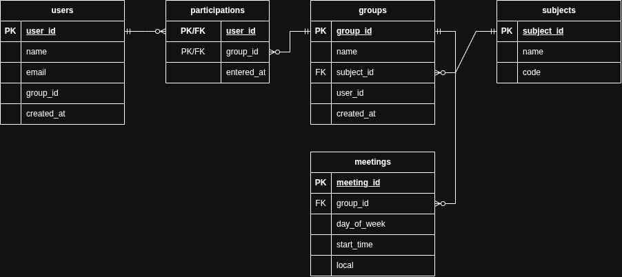

# DATA TO BE PERSISTED

Data stored in arrays/objects that must persist across page reloads:

## 1. Study Groups
- `id` (number): unique identifier (primary key).
- `subject` (string): subject name.
- `students` (number): number of students.
- `schedule` (string): day of the week (schedule).

## 2. User
- `name` (string): user's name.
- `email` (string): email address.
- `subjects` (number[]): array of group `id`s assigned to the user.

# SUPABASE
- `project name`: learnplat
- `region`: us-east-1

# ENTITIES AND ATTRIBUTES

| **USER** | **SUBJECT** | **GROUP** | **MEETING** |
|---|---|---|---|
| name | **name** | group name | day of the week |
| **e-mail** | **code** | participant limit | start time |
| registration date | | creation date | location |
| type (student or teacher) | | | |

**in bold**: candidate identifier  
**Attribute types:**: `students` is a derived attribute. `subjects` is a multivalued attribute.

# PROJECT RELATIONSHIPS

| Relationship | Left Side | Right Side | Type |
| --- | --- | --- | --- |
| `Item` has `Group` | Exactly one item | Zero or more groups | 1:N |
| `Group` has `Meeting` | Exactly one group | Zero or more meetings | 1:N |
| `User` has `Participation` | Exactly one user | Zero or more participations | 1:N |
| `Group` has `Participation` | Exactly one group | Zero or more participations | 1:N |

The last two relationships together form an N:N relationship between `User` and `Group`, resolved through the `Participation` entity.

# DER

- A subject has zero or many groups; each group belongs to exactly one subject.
- A group has zero or many meetings; each meeting belongs to exactly one group.
- A user has zero or many participations; each participation belongs to exactly one user.
- A group has zero or many participations; each participation belongs to exactly one group.
The last two together form the N:N (many-to-many) relationship between users and groups.
